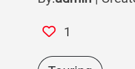

# PEDAL
Welcome to PEDAl.
Pedal is a space for showcasing amazingly unique bike builds.
Where biker lovers of all kinds can come to admire other peoples builds and post an
article about their own unique build. Whether its a refurbished 90's mtb, a brand new 
carbon gravel bike or a vintage steel road racer, all is welcome. Its a place to encourage tinkering
around with bike parts and sharing your expierience with others. 
Dont settle for an off the shelf bike, experiment.
And check out parts and components from other bike categories to yours, they might inspire something unique
Nothing is too weird!! 
A blog / forum where members can post images and decriptions of their bikes. Anyone can visit the site and scroll through all the bikes for inspiration and advice.
Whether its a custom DIY build with new or repurposed frames and parts, a professional commisioned bike or even an off the shelf bike with a few minor customizations.
Memebers of the site can post their own articles, comment on others and like / vote on builds they love.
Its purpose is to create a community of people to share their ideas, advice and reviews of bike parts,and specific configurations.
It is inclusive of all styles of bikes, from road to bmx, allowing cross over of ideas.
Similar spaces may exist but tend to lean towards very niche areas of bike styles.
This is am MVP(minimum viable product) So more features will be added and exsisting ones improved, after initial fedback.
Enjoy!! 


## UX/UI
The UX / UI of PEDAL has been designed to be easy to use and to encourage users to interact with the content. The website is well-organized and the content easy to find. All users can access all posts, click on a post card to expand it and see all the information and images within that post, and see other user's comments on said post. Once a user wants to interact with the content with more features, a simple sign-up process sets up their account. Once logged in they can create, update and delete their article and create, update, and delete their comments. It is designed to be as intuitive as possible.
All the bike posts are also sorted by categories, with clickable links/tags on each post card and post view, directing the user to a list of all the bikes from the same category as the one they clicked. The design process was aided by an agile tool from GitHub, using user stories as well as site owner/admin stories to help create an app that is a pleasure to interact with and manage. The site also features an easily accessible administration panel to manage content and user accounts. 
Logged-in users can create and edit content with ease thanks to the site's intuitive forms. The focus is on the bikes and the content. The site is styled in a simple pretty monochrome scheme with small accents of the brand colour. The other colours used are just for informative purposes, with no bold hero images or banners, and just off-white backgrounds, letting the post images do all the talking. Components have been well-spaced out to avoid a cluttered experience. The use of white buttons with a coloured outline that fills in when interacted with keeps this clean and spacious, but by using the fill colours the buttons are easily identified and separated for their different uses. The Pedal project was designed with the user experience at the forefront, this can be seen with the mobile-first approach, considering the users on a mobile device as a majority target market. The layout changes smoothly across all screen sizes and remains as easy to navigate with very different changes to the structure. The most important part of the UX is probably the navigation of the site, and how intuitive it is. This was achieved by keeping the header/navbar clean with just the most used features left visible and the rest behind a full-width drop-down navigation area and info section. With more navigation links found at the bottom of every page in the footer. 
All pages follow a very similar layout keeping consistency across the site, and the UX a happy one.


### Colour Scheme

The colour scheme is based around a basic monochrome style, with black and white. While the majority of all pages are made up of an off-white background, with the black header/navigation bar, text and buttons the monochrome theme is established. The only other assthetic colour used is the pop of neon green/yellow. This is a strong contrasting colour and is for this reason used sparingly to have a big impact when used. It is seen in the logo and as a way to highlight certain clickable links. This whole colour scheme is simple but simple by design. As the content of the posts/articles takes up most of the blank space, and is centered on images uplaoded by users, I felt in was important not have an over use of colour, so as not to clash or overcrowd the aestics of the site. Most views the user will see will be either a list of posts with very minimal information under a large image, or a view of a post in detail, which will have 3 large images at the head of a block of text. This simplicity of whate and black allows the post view to take on the theme of the photographs. The other colours used are basic green red and blue colours used to highlight buttons for log-in, log-out, edit, delete or success messages. These are important for intuitive navigation. 

- `#f4f4f4` used for background.
- `rgb(65, 65, 65)` used for text.
- `rgb(190, 190, 8)` used for accent colour.
- `red` used for liked heart.

I used [coolors.co](https://coolors.co/palette/f4f4f4-414141-000000-bebe08) to generate my colour palette.


I've used CSS `:root` variables to easily update the global colour scheme by changing only one value, instead of everywhere in the CSS file.

```css
:root {
    --background: #f4f4f4;
    --background-light: #eeee;
    --accent: rgb(190, 190, 8);
    --grey: rgb(65, 65, 65);
    --liked: red;
}
```

### Typography

I have used Google Fonts to source the two main fonts for accross the site. the size of its library along with the ease of implemtation makes it a great resource.

The main feature font is Agdasima used for titles, headers logo and some links.

>" Agdasima is based on Big Shoulders, a condensed American Gothic sans-serif font family."

- [Agdasima](https://fonts.google.com/specimen/Agdasima)


The secondary font used for lighter text and large bodies of text is Roboto.

> "Roboto has a dual nature. It has a mechanical skeleton and the forms are largely geometric. At the same time, the font features friendly and open curves. While some grotesks distort their letterforms to force a rigid rhythm, Roboto doesn’t compromise, allowing letters to be settled into their natural width. This makes for a more natural reading rhythm more commonly found in humanist and serif types."

- [Roboto](https://fonts.google.com/specimen/Roboto)

Font Awesome was used throughtout the site for logos and icons. Its extensive library gives many options to add icons with different styles and weights.

- [Font Awesome](https://fontawesome.com)

## User Stories

- As a site owner I need a data base to store and organise the information of all users posts
- As a site owner I need a database to store and organise the information of all user's comments
- As a admin member I can access admin section so that I can create update and delete posts for content moderation
- As an admin member, I can access the admin section so that I can create update and delete comments for content moderation 
- As a user I can register an account so that I have access to the features available to members
- As a user I can login in to my account so that I can access memebers features
- As a user I can log out of my account so that I can secure my browser from others using my account 
- As a user I can log out of my account so that I can secure my browser from others using my account 
- As a user I can view all other posts on one main page so that I can see a brief outline of each post
- As a user I can view each post on its own page so that I can read and interact with all the information
- As a user I can comment on other posts so that I can leave feedback, get more info, and interact with other users
- As a user I can like or vote on a post so that popular posts are visible and I can see what posts I have enjoyed 
- As a site owner I need guest users to be able to read posts, comments and likes but not interact or create so that information is freely available but will encourage user to sign up
- As a user I can create a post so that to share info and images of my bike build
- As a user I can edit and delete posts so that I have full control over my content
- As a user I can view the posts filtered by certain criteria so that the content can be more targeted to me interests
- As a user I can I can view a list of posts I have liked so that I can easily view my favourite posts

### User stories for future development

- As a site owner I can restrict user account signup to email verified only so that users are verified, and forgot passwords can be automated
- As a user I can view all post images in their own gallery so that images can be viewed in a larger more interactive format
- As a site owner I can run and manage and internal mini blog of videos of bike tips and trick so that I can add more useful content to keep users engaged in the website

## Wireframes


To follow best practice, wireframes were developed for mobile, and desktop sizes. Tablet sizes were obviously a big consideration, but the decision was made that the tablet size would be layed out almost identical to the desktop while in landscape and mobile in portrait of narrow tablets. Any small changes needed to the layout could be done on the fly while developing and testing, the need for a set of wireframes for the tablet view was not need in the particular design.

I've used [Balsamiq](https://balsamiq.com/wireframes) to design my site wireframes.

### Landing Page Wireframes

| Size | Screenshot |
| --- | --- |
| Mobile |  |
| Desktop |  |

### List View Wireframes

| Size | Screenshot |
| --- | --- |
| Mobile |  |
| Desktop |  |

### Post Detail View Wireframe

| Size | Screenshot |
| --- | --- |
| Mobile |  |
| Desktop |  |

### Comment Section Wireframe

| Size | Screenshot |
| --- | --- |
| Mobile |  |
| Desktop |  |

## Features

### Existing Features

- **Navagation bar**

    - At the top of every page or view the user lands on there is a black navigation bar, stretching full width. It features a logo on the left that doubles as a clickable link to the home page. On the far right is a clickable icon of three horizontal bars. This opens a collapsed menu from the top down, pushing the navbar down with it. Inside this collapsed menu, there is a brief description of the site, and a vertical ascending list of links to other pages on the site, 'Home', 'About', 'Contact', 'T&Cs'. The other feature of the nav bar is the two links spaced to the right of center of the always visible bar. When the user is not logged in these are 'log-in' and 'sign-up' and when the user is logged in they are 'log-out' and 'profile' links. Each link redirecting the user to pages to log in/out or sign-up to create an account. The profile link will send the user to a page of their posts, and other options only available to logged in users, more explained on this later. The main function of a nav bar is obviously to allow the user to navigate around the site and its multiple pages. However is also an important style feature for aesthetics of the site. For this application I have kept it vey simple and clean, by hiding a lot of its featues behind the collapsable section. This leaves the important and most commonly used featues at easy reach, without having to loose the full functionallity. By removing clutter, I believe it keeps the concentration on the content. It is also important to have the relevant user account management controls always at hand, to log-in or out or sign up if a user is not yet a member.


- **Logo header**

    - Below the navigation bar on the homepage, is a large landing area, with a large logo and site name in the center. This along with the nav bar takes up the whole window of whatever device its being viewed on. Rather than putting an image here I wanted to push the logo to help make it stick in the users mind. It is also a place to introduce the accent colour setting the colour theme as soon as the user lands on the website. This open area creates space before delving into the content proper.


- **Main post list**

    - Below the logo section on the homepage begins the first look at the main site content. It is a list of posts, each displayed in their own 'post cards' floating on the background. In mobile view they are one at a time above each other, each post taking up most of the screen. On larger screens they are laid out in rows of three. Once there is more than 9 posts the page is paginated with next, previous and numerical buttons to navigate the list easily. Each card shows the main image of the post and some basic info. At the bottom of the list is a large button, 'Show Us Your Bike' This will direct the user to either a create a post form or if not logged in to a sign-up page. This is how all the content is displayed when in list form on the site, whether viewing posts of specific categories or post tyou have liked. The design process of this is to create a board of posts with large images to attract attention, and encourage scrolling through many posts while giving enough information to the user to make a decision on whether they want to click and view the more detailed view of a post. The background of the cards are slightly lighter that the main background with a gentle shadow around the border of each card. Giving the impression they are lifted off the surface. 


- **Post Cards**

    - Each post card in any of the list views are the same with the only differences when a user views their own posts, there are two extra links at the bottom, edit and delete. Otherwise this feature is consistent accross the site. Made up of a large image at the top. Underneath are to icons, one is a heart with res outline and the other is a speech bubble. Beside each will be a number. The heart shows how many times that post has been likes by a user, the other how many comments that post has been left. Below this is posts title, doubling as a link to the detailed view of that post. Below that is some basic info about the post, who created it and when it was created. And finally in the footer of the card there are 3 tags/buttons. Each button corresponds to one of three lists of categories. These are clickable and help filter the list of posts. These cards are therefore multifunctional, a way to display some basic information and allow the viewing of many posts quickly, but also a way to filter through the posts from any point through a list, without having to return to a navbar. The consistency of the styling helps site navigation a feeling of ease. The cards are organised by their creation date, newest ones first keeping the content looking fresh for returning customers.


- **Categorey tags**

    - The three tags mentioned above are an important feature of the site, and are found on all post cards and in the detailed view of each post. The first on the left is a categorey of bike types, each bike when the post is created will be assigned a value for this categorey, road bike, mountainbike, fixie etc. Whatever bike style that post is, will be displayed on the tag. This clickable tag will bring the user to another list of all the bikes that match that catergoey. The second and third tags works the same, one for handlebar types the other for gearing set ups. This is designed to aid the user to view the bikes they are interested in and to compare like for like. There is no need to scroll through all the bikes if you only have interest in bmx bikes. A simple filtering tool and very intuitive.


- **Post detail view**

    - Once a user clicks into a post a detailed view of the post is displayed, this view still mimics the post cards but without a border and larger. Keeping the same structure, with image top and center, but now 2 other images are shown, under the large main image. 
    Followed by the same info as the cards with titles author and created date, and ofcourse the liked heart and speech bubble, with corresponding numbers. However here the like heart is clickable, turning it completely red and beating if current you have liked it.Below this area is the main content of the post where the user has filled in all the information the want to share about the bike build. A simple and effective layout showing all the information in a stylish way, basically a larger expanded post card. The user can click read enjoy and hit the heart if they want to show their love and save it for viewing later. Below this main detail view is a comment section, where users can interact with each other and discuss that post.


- **Liked hearts**

    - The liked hearts are another important feature of the site, they are away of showing your love for a post and a way to save and find the ones you have viewed and enjoyed. It is a feature only available to logged in users. It can only be clicked from within the post detail view, but the number of likes a post has can be viewed from any of the post cards. If a user is viewing a post they have liked the whole heart will be filled in in red and beating. When the user enters the profile page, there is a button to a list of all the posts that the current user has liked. This feature helps the site and user in a few ways, creating a level of interaction with the content, away to compare different posts, and simply a kind of bookmark feature. 




- **Comment section**

    - The comment section is pretty self explanitory, and I have kept this looking pretty standard, to help people feel comfortable. 
    In mobile view directly under the main post detail view, there is a box where a user can write their own comment and submit, directly under this is the full list of posts belonging to that post. On larger screens the comments are moved to the left of the screen while the text box is on the right. When a user submits a comment it is stored in a database model for all the comments, linked to the post by a slug. If the user is logged in the comments they have left will have two buttons under that specific comment one for edit and one for delete, both of these send the user to a form to either edit or delete. Like the posts, the comments are ordered by their creation date, but with the comments it is oldest first, to keep the converversation flowing naturally. This feature is vital for users to interact with each other, and helps to naturally and informally create more content. 


- **Profile Page**

    - The profile page, available only to looged users, starts with three buttons, one to create a post, one to show a list of all their liked posts, and the final is a dropdown, where the user can log-out or delete their account (keeping the later two in a dropdown as  a way to help prevent accidental clicking, even though they both have another page to check if the user is sure.)Below thse buttons the user will find a list oview of post cards of the posts they have created if any. And each card with a edit and delete button for that post. This is a functional page needed to help a user manage their account and their content. A space that could see many more features as the site grows more features and functionallity.


- **Create, edit and delete posts**

    - Throughout the site there are a few places where th user can click into a form to create a post. This form based on the database model for the posts has a few input boxes, each corresponding to specific pieses of data needed to build the post views. Starting with a title, which auto populates a slug field for the backend, then three drop down lists, for each of the three tag categories, another three fields for three seperate images the first being the main feature image. Then a large text bax where the creater can add any extra content they want. On submit the information is stored in the database and the post is created and linked to the user. The user is then redirected to the newly created post page, with a pop up success message, that auto dissapears. From the profile page when the user views their previously created posts they will have a edit and delete button. The edit button will bring them to a form identical to the create a post form, but with the fields prepopulated which can be edited. The submit proccess works the same. When the delete button is clicked the user is brought to a very simple page, stating thay are about to delete their post and it is permanent, if they want to continue. If they do, they will be redirected to the profile page with a success message saying post has been deleted. The deletion of a post will also delete all the comments linked to it. All these features are vital for a fully functioning application with full CRUD features. This gives the users control over their content.


- **Sign-up, log-in and log-out**

    - The management of the user database is controlled by the internal django feature 'allauth' once installed and configured it handles the data, and supplies templates for sign-up, log-in, log-out, and many more pages. These have been styled and content added to match the sites themes and consitent features, like buttons. The user can can sign-up and log-in/out from a few different places thoughout the site, it is intuitive and a simple proccess. For now the data needed for createing an account is minimal, username, email(optional), and password. This can be extended as the site grows to use email verification, and collect more data if needed. Without these features the site cant function the way it needs to, either not allowing users to create content or allowing anyone to, opening it to abuse.


- **Delete User**

    - The delete user function is not handled by allauth. Here I have a function that will delete the user instance from the database. In the profile page in the account drop-down button there is an option to delete your user account. This is completed with a very familiar style form to others with buttons, and warnings to make users aware of what they are doing. This will not only delete that user but also all their posts and any comment made by them. I think this is a neccesary feature to give the user complete control over their data and content. 


- **About section**

    - The about, contact and t&c section all exist on the one page, but individual links, the user will be brought to the specific part of the page. The about section is simply a paragraph of text explaining the website and its mission. An exteded explanation to what is found in the collapsed nav bar. just a little help to users to get a feel for what the project is all about.


- **Contact Section**

    - The contact section is again a simplified one, this is not a business selling a product or a shop with a bricks and mortar address, so the contact section lists the social media sites with associated accounts, as in the footer, with an email icon that links the user to their email provider account to send an email to PEDAL with a prepoulated email address field. The main feature in this section comes in the messaging form. With the click of a send message button the user is brought to a form where thay can message the admin staff directly within the application. For this there is a seperate database model, to collect and organise the messages, for the admin staff to view within the django admin panel. The form only needs the users email address for a reply, their name and a message. This is convenient for a mvp as it is reasonably lightweight and keeps all the data within the application, again as the site grows an email form could be linkied diectly to an email address with smtp, but it could be still good practice to store this data within the application anyway. This contact form is a good way for users to contact admin staff with more technical questions like password reset or help removing content, where general news and information can be communicated better over the social media channels.


- **Terms and conditions**

    - The terms and conditions section follows up after the contact section on the about page, it can be navigated to directly through its own link in the collapsable nav bar or the footer. It outlines the general rulles and conduct of behaviour for all users who interact with the application. It is important to have these guidelines out-lined and easliy accesible. A purpose decision was to allow content to be added freely and quickly by users with waiting for approval, as I feel that can affect the user experience. When the guidlines are clear, the admin staff can monitor the content and simply remove when a breach has occurred. There is obviously flaws with this leaving opening for abuse until spotted, but for a small mvp project it keeps the UX smooth, until more policing of content is needed.


- **Footer**

    - The footer is the area at the bottom of every page, it and the nav bar are contained within a base html file, within which all the other templates are added by the django views. In this section is the list of internal page/navigation links making them eady to access from anywhere on the site, there is also all the social media account links. This feature is an important navigational and user experience tool for a functioning website.


- **Admin panel**

    - Django supplies a batteries included admin panel, that once configured is a hugely iseful tool to a site like this. The panel has been set up to display data from the 3 database models. this data can be filtered and organise in different ways. It is an tool used by any admin staff / owner of the site who has access, where all the data can be read created, updated and removed, great for content moderation and user account management. 


### Future Features

- Email Verification
    - Through allauth with django an email verification can bet set up using an smtp email service. This allows the site to checkthe user has given a valid email address my emailing and have the user use that email to create the account. This is also great for password reset functionallity. A simple feature to introduce once the project is out of the mvp stage, and after some initial feedback about all the base features.
- Blog
    - within the projest itself another djanjo app could be developed to hold a lightweight blog, only curated with content by the site owners, something like links to videos on how to do some common bike maintenace jobs, how to paint a bike frame, how to clean your gears properly, etc. general tips and tricks, also maybe a bike post of the month, included. Not to include comments sections, or like buttons. but just a video or article link and brief description. I could show sample list of posts underneath the post lists of the main blog/forum before the footer and also on a page of its own.
- Full contact form with smtp mail service 
    - Rather than just an internal messaging form this could be expanded to a proper email form, with more automation.
- Enrich comment section
    - The comment section if proves to be popular, could be added to, ideas like pagination of comments if the numbers of comments per posts affect ux, also nesting of comments allowing comments themselves to be replied to, which will also help contain large numbers of comments. Also a more feature rich text input box for the comments allowing styling of text and even emojis.
- Image modal
    - Another nice feature would be to add a pop up image gallery modal in the post deail view. by clicking on one of the photos a madal almost full screen size could appear, with a gallery of all the images within the post, showing one at a time and a navigation arrow left and right to view all the photos full screen. I could allow users to post more than 3, with anything over the 3 being hidden within the madal. It will keep the structure of the detail view intact, but allow nice interaction with the images.
- ForumPost model
    - The main database model ForumPost could also be extend to include more categoreies for tags, or a list of bike parts that the creater could fill in whatmake and model thay have on their build they have on their build. This would increase the amount of content in each post, and have more data that will be easily filterable.
- Seach bar
    - The current filtering available through the tags is great when the quantity of content is still low, but in the future if the quantity gets to bifg theat filtering isnt sufficient, a keyword search bar would make more sense.


## Tools & Technologies Used

- [HTML](https://en.wikipedia.org/wiki/HTML) used for the main site content.
- [CSS](https://en.wikipedia.org/wiki/CSS) used for the main site design and layout.
- [CSS :root variables](https://www.w3schools.com/css/css3_variables.asp) used for reusable styles throughout the site.
- [CSS Flexbox](https://www.w3schools.com/css/css3_flexbox.asp) used for an enhanced responsive layout.
- [CSS Grid](https://www.w3schools.com/css/css_grid.asp) used for an enhanced responsive layout.
- [JavaScript](https://www.javascript.com) used for user interaction on the site.
- [Python](https://www.python.org) used as the back-end programming language.
- [Git](https://git-scm.com) used for version control. (`git add`, `git commit`, `git push`)
- [GitHub](https://github.com) used for secure online code storage.
- [Gitpod](https://gitpod.io) used as a cloud-based IDE for development.
- [Bootstrap](https://getbootstrap.com) used as the front-end CSS framework for modern responsiveness and pre-built components.
- [Django](https://www.djangoproject.com) used as the Python framework for the site.
- [PostgreSQL](https://www.postgresql.org) used as the relational database management.
- [ElephantSQL](https://www.elephantsql.com) used as the Postgres database.
- [Heroku](https://www.heroku.com) used for hosting the deployed back-end site.
- [Cloudinary](https://cloudinary.com) used for online static file storage.


## Database Design

Entity Relationship Diagrams (ERD) help to visualize database architecture before creating models.
Understanding the relationships between different tables can save time later in the project.


```python
class ForumPost(models.Model):

    class Bikes(models.TextChoices):
        NONE = 'N/A', 'N/A'
        ROAD = 'Road', 'Road'
        GRAVEL = 'Gravel', 'Gravel'
        CX = 'CX', 'CX'
        TOURING = 'Touring', 'Touring'
        MTB = 'MTB', 'MTB'
        DOWNHILL = 'Downhill', 'Downhill'
        FIXIE = 'Fixie', 'Fixie'
        COMMUTE = 'Commute', 'Commute'
        BMX = 'BMX', 'BMX'
        HYBRID = 'Hybrid', 'Hybrid'
        OTHER = 'Other', 'Other'

    class Bars(models.TextChoices):
        NONE = 'N/A', 'N/A'
        FLAT = 'Flat', 'Flat'
        DROP = 'Drop', 'Drop'
        ALT = 'Alt', 'Alt'
        OTHER = 'Other', 'Other'

    class Gears(models.TextChoices):
        NONE = 'N/A', 'N/A'
        FIXED = 'Fixed', 'Fixed'
        ONE = '1X', '1X'
        TWO = '2X', '2X'
        THREE = '3X', '3X'
        HUB = 'Hub', 'Hub'
        OTHER = 'Other', 'Other'

    title = models.CharField(max_length=150, unique=True)
    slug = models.SlugField(max_length=150, unique=True)
    created_on = models.DateTimeField(auto_now_add=True)
    updated_on = models.DateTimeField(auto_now=True)
    author = models.ForeignKey(
        User, on_delete=models.CASCADE, related_name="forum_posts")
    bikes = models.CharField(
        max_length=20, choices=Bikes.choices, default=Bikes.NONE)
    bars = models.CharField(
        max_length=20, choices=Bars.choices, default=Bikes.NONE)
    gears = models.CharField(
        max_length=20, choices=Gears.choices, default=Bikes.NONE)
    cover_image = CloudinaryField('image', default="placeholder")
    second_image = CloudinaryField('image', default="placeholder")
    third_image = CloudinaryField('image', default="placeholder")
    content = models.TextField()
    likes = models.ManyToManyField(
        User, related_name='forum_like', blank=True)

    class Meta:
        ordering = ['-created_on']

    def __str__(self):
        return self.title

    def number_of_likes(self):
        return self.likes.count()

    def save(self, *args, **kwargs):
        if not self.slug:
            self.slug = slugify(self.title)
        return super().save(*args, **kwargs)

class Comment(models.Model):
    post = models.ForeignKey(
        ForumPost, on_delete=models.CASCADE, related_name='comments')
    created_on = models.DateTimeField(auto_now_add=True)
    updated_on = models.DateTimeField(auto_now=True)
    author = models.ForeignKey(
        User, on_delete=models.CASCADE, related_name='user_comments')
    body = models.TextField()

    class Meta:
        ordering = ['created_on']

    def __str__(self):
        return f"Comment {self.body} by {self.author}"

class Messages(models.Model):
    name = models.CharField(max_length=150)
    email = models.EmailField()
    message = models.TextField()
    date_sent = models.DateTimeField(auto_now_add=True)
    author = models.ForeignKey(
        User, on_delete=models.CASCADE, related_name='user_message')

    class Meta:
        ordering = ['-created_on']
```


## Agile Development Process

### GitHub Projects

[GitHub Projects](https://github.com/dylankane/pedal/projects) served as an Agile tool for this project.
It isn't a specialized tool, but with the right tags and project creation/issue assignments, it can be made to work.

Through it, user stories, issues, and milestone tasks were planned, then tracked on a weekly basis using the basic Kanban board.


### GitHub Issues

[GitHub Issues](https://github.com/dylankane/pedal/issues) served as an another Agile tool.
There, I used my own **User Story Template** to manage user stories.

It also helped with milestone iterations on a weekly basis.

- [Open Issues](https://github.com/dylankane/pedal/issues)

    

- [Closed Issues](https://github.com/dylankane/pedal/issues?q=is%3Aissue+is%3Aclosed)

    

### MoSCoW Prioritization

I've decomposed my Epics into stories prior to prioritizing and implementing them.
Using this approach, I was able to apply the MoSCow prioritization and labels to my user stories within the Issues tab.

- **Must Have**: guaranteed to be delivered (*max 60% of stories*)
- **Should Have**: adds significant value, but not vital (*the rest ~20% of stories*)
- **Could Have**: has small impact if left out (*20% of stories*)
- **Won't Have**: not a priority for this iteration

## Testing

For all testing, please refer to the [TESTING.md](TESTING.md) file.

## Deployment

The live deployed application can be found deployed on [Heroku](https://pedal-forum-80408630e3b0.herokuapp.com).

### ElephantSQL Database

This project uses [ElephantSQL](https://www.elephantsql.com) for the PostgreSQL Database.

To obtain your own Postgres Database, sign-up with your GitHub account, then follow these steps:
- Click **Create New Instance** to start a new database.
- Provide a name (this is commonly the name of the project: pedal).
- Select the **Tiny Turtle (Free)** plan.
- You can leave the **Tags** blank.
- Select the **Region** and **Data Center** closest to you.
- Once created, click on the new database name, where you can view the database URL and Password.

### Cloudinary API

This project uses the [Cloudinary API](https://cloudinary.com) to store media assets online, due to the fact that Heroku doesn't persist this type of data.

To obtain your own Cloudinary API key, create an account and log in.
- For *Primary interest*, you can choose *Programmable Media for image and video API*.
- Optional: *edit your assigned cloud name to something more memorable*.
- On your Cloudinary Dashboard, you can copy your **API Environment Variable**.
- Be sure to remove the `CLOUDINARY_URL=` as part of the API **value**; this is the **key**.

### Heroku Deployment

This project uses [Heroku](https://www.heroku.com), a platform as a service (PaaS) that enables developers to build, run, and operate applications entirely in the cloud.

Deployment steps are as follows, after account setup:

- Select **New** in the top-right corner of your Heroku Dashboard, and select **Create new app** from the dropdown menu.
- Your app name must be unique, and then choose a region closest to you (EU or USA), and finally, select **Create App**.
- From the new app **Settings**, click **Reveal Config Vars**, and set your environment variables.

| Key | Value |
| --- | --- |
| `CLOUDINARY_URL` | user's own value |
| `DATABASE_URL` | user's own value |
| `DISABLE_COLLECTSTATIC` | 1 (*this is temporary, and can be removed for the final deployment*) |
| `SECRET_KEY` | user's own value |

Heroku needs two additional files in order to deploy properly.
- requirements.txt
- Procfile

You can install this project's **requirements** (where applicable) using:
- `pip3 install -r requirements.txt`

If you have your own packages that have been installed, then the requirements file needs updated using:
- `pip3 freeze --local > requirements.txt`

The **Procfile** can be created with the following command:
- `echo web: gunicorn app_name.wsgi > Procfile`
- *replace **app_name** with the name of your primary Django app name; the folder where settings.py is located*

For Heroku deployment, follow these steps to connect your own GitHub repository to the newly created app:

Either:
- Select **Automatic Deployment** from the Heroku app.

Or:
- Select **Manual Deployment** from the Heroku app.

Or:
- In the Terminal/CLI, connect to Heroku using this command: `heroku login -i`
- Set the remote for Heroku: `heroku git:remote -a app_name` (replace *app_name* with your app name)
- After performing the standard Git `add`, `commit`, and `push` to GitHub, you can now type:
	- `git push heroku main`

The project should now be connected and deployed to Heroku!

### Local Deployment

This project can be cloned or forked in order to make a local copy on your own system.

For either method, you will need to install any applicable packages found within the *requirements.txt* file.
- `pip3 install -r requirements.txt`.

You will need to create a new file called `env.py` at the root-level,
and include the same environment variables listed above from the Heroku deployment steps.

Sample `env.py` file:

```python
import os

os.environ.setdefault("CLOUDINARY_URL", "user's own value")
os.environ.setdefault("DATABASE_URL", "user's own value")
os.environ.setdefault("SECRET_KEY", "user's own value")

# local environment only (do not include these in production/deployment!)
os.environ.setdefault("DEBUG", "True")
```

Once the project is cloned or forked, in order to run it locally, you'll need to follow these steps:
- Start the Django app: `python3 manage.py runserver`
- Stop the app once it's loaded: `CTRL+C` or `⌘+C` (Mac)
- Make any necessary migrations: `python3 manage.py makemigrations`
- Migrate the data to the database: `python3 manage.py migrate`
- Create a superuser: `python3 manage.py createsuperuser`
- Load fixtures (if applicable): `python3 manage.py loaddata file-name.json` (repeat for each file)
- Everything should be ready now, so run the Django app again: `python3 manage.py runserver`

#### Cloning

You can clone the repository by following these steps:

1. Go to the [GitHub repository](https://github.com/dylankane/pedal) 
2. Locate the Code button above the list of files and click it 
3. Select if you prefer to clone using HTTPS, SSH, or GitHub CLI and click the copy button to copy the URL to your clipboard
4. Open Git Bash or Terminal
5. Change the current working directory to the one where you want the cloned directory
6. In your IDE Terminal, type the following command to clone my repository:
	- `git clone https://github.com/dylankane/pedal.git`
7. Press Enter to create your local clone.

Alternatively, if using Gitpod, you can click below to create your own workspace using this repository.

[](https://gitpod.io/#https://github.com/dylankane/pedal)

Please note that in order to directly open the project in Gitpod, you need to have the browser extension installed.
A tutorial on how to do that can be found [here](https://www.gitpod.io/docs/configure/user-settings/browser-extension).

#### Forking

By forking the GitHub Repository, we make a copy of the original repository on our GitHub account to view and/or make changes without affecting the original owner's repository.
You can fork this repository by using the following steps:

1. Log in to GitHub and locate the [GitHub Repository](https://github.com/dylankane/pedal)
2. At the top of the Repository (not top of page) just above the "Settings" Button on the menu, locate the "Fork" Button.
3. Once clicked, you should now have a copy of the original repository in your own GitHub account!


## Credits

### Content

| Source | Location | Notes |
| --- | --- | --- |
| [Markdown Builder](https://traveltimn.github.io/markdown-builder) | README and TESTING | tool to help generate the Markdown files |
| [YouTube(Codemy.com)](https://www.youtube.com/@Codemycom/featured) | django code | A gereneral resource for django tutorials, with specific playlist buiding  a blog |
| [YouTube (Very Academy)](https://youtu.be/cWq6jQGWmEg) | ForumPost Model | Help to structure choices field in model |
| [!def](https://notdefined.tech/blog/how-to-fix-django-error-related-field-got-invalid-lookup-icontains/) | admin.py | Ability to search by FK field in admin panel |
| [YouTube (Very Academy)](https://www.youtube.com/watch?v=EUUjJdw3EBM) | views.py | Help to build and understand class based views, in particular update view |
| [Classy Class-Based Views](https://ccbv.co.uk/) | views.py | Help understanding django class based views and how to update methods in them |
| [StackOverflow](https://stackoverflow.com/) | entire site | problem solving all sorts of bugs and issues |
| [django-allauth](https://django-allauth.readthedocs.io/en/latest/configuration.html) | user accounts | documents helping manage user accounts |
| [mdbootstrap](https://mdbootstrap.com/docs/standard/navigation/navbar/) | navbar base.html | code snippet for structure to use collapsable nav bar, basic bootstrap structure of footer from this site was used aswell  |
| [StackOverflow](https://stackoverflow.com/questions/73589078/how-to-filter-liked-posts-by-user-django) | views.py | How to filter liked posts by User |
| [LearnDjango](https://learndjango.com/tutorials/django-slug-tutorial) | models.py | Django slug tutorial |
| [bootstrap](https://getbootstrap.com/docs/4.0/utilities/flex/) | front end layout | For the use of flex and grids |
| [W3Schools](https://www.w3schools.com/django/django_queryset_filter.php) | categories function in views.py | Code structure to join queryset filters |

### Media

| Source | Location | Type | Notes |
| --- | --- | --- | --- |
| [FontAwesome](https://fontawesome.com/) | entire site | icon | icons on all pages |
| [The Radivist](https://theradavist.com/) | post creation | images | used to take photos of bikes to make posts to poulate the site |
| [Vintage Trek](http://www.vintage-trek.com/Trek_galleryKR.htm) | post creation | images | used to take photos of bikes to make posts to poulate the site |
| [VectoStock](https://www.vectorstock.com/royalty-free-vector/road-bicycle-parts-and-accessories-silhouette-set-vector-8841664) | placeholder | image | Used in a post where no uploaded image is available |

### Acknowledgements


- I would like to thank my Code Institute mentor, Rory Patrick Sheridan for their support throughout the development of this project. A massive help
- I would like to thank the [Code Institute](https://codeinstitute.net) tutor team for their assistance with troubleshooting and debugging some project issues.
- I would like to thank the [Code Institute Slack community](https://code-institute-room.slack.com) for the moral support and wealth of knowledge. Another great resource to have.
- I would like to thank my partner and kids, for believing in me, and allowing me to make this transition into software development.
