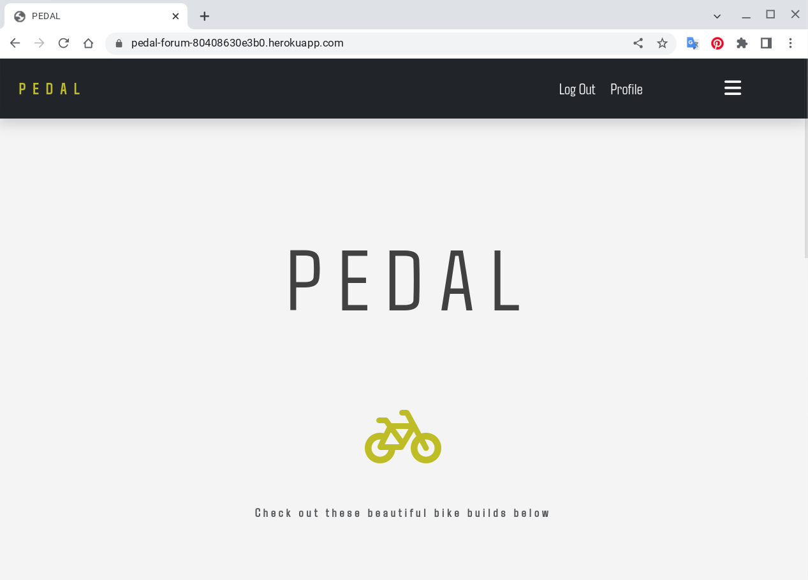

# Testing

Return back to the [README.md](README.md) file.

## Code Validation

### HTML

I have used the recommended [HTML W3C Validator](https://validator.w3.org) to validate all of my HTML files.

| Page | W3C URL | Screenshot | Notes |
| --- | --- | --- | --- |
| Home | [W3C](https://validator.w3.org/nu/?showsource=yes&doc=https%3A%2F%2Fpedal-forum-80408630e3b0.herokuapp.com%2F) |  | No errors or warnings to show |
| About | [W3C](https://validator.w3.org/nu/?showsource=yes&doc=https%3A%2F%2Fpedal-forum-80408630e3b0.herokuapp.com%2Fabout%2F) |  | No errors or warnings to show |
| Sign-Up | [W3C](https://validator.w3.org/nu/?showsource=yes&doc=https%3A%2F%2Fpedal-forum-80408630e3b0.herokuapp.com%2Faccounts%2Fsignup%2F) |  | No errors or warnings to show |
| Log-in | [W3C](https://validator.w3.org/nu/?showsource=yes&doc=https%3A%2F%2Fpedal-forum-80408630e3b0.herokuapp.com%2Faccounts%2Flogin%2F) |  | No errrors or warnings to show |
| Categories | [W3C](https://validator.w3.org/nu/?showsource=yes&doc=https%3A%2F%2Fpedal-forum-80408630e3b0.herokuapp.com%2Fcategories%2FRoad%2F) |  | No errors or warnings to show |
| Profile | n/a |  | No errors or warnings to show |
| Liked | n/a |  | No errors or warnings to show |
| Create Post | n/a |  | No errors or warnings to show |
| Edit Post | n/a |  | No errors or warnings to show |
| Delete Post | n/a |  | No errors or warnings to show |
| Edit Comment | n/a |  | No errors or warnings to show |
| Delete Comment | n/a |  | No errors or warnings to show |
| Contact Message | n/a |  | No errors or warnings to show |
| Delete User | n/a |  | No errors or warnings to show |
| Log Out | n/a |  | No errors or warnings to show |
| x | n/a |  | No errors or warnings to show |

### CSS

I have used the recommended [CSS Jigsaw Validator](https://jigsaw.w3.org/css-validator) to validate all of my CSS files.

| File | Jigsaw URL | Screenshot | Notes |
| --- | --- | --- | --- |
| style.css | n/a |  | Pass: No Errors |

### JavaScript

I have used the recommended [JShint Validator](https://jshint.com) to validate all of my JS files.

⚠️⚠️⚠️⚠️⚠️ START OF NOTES (to be deleted) ⚠️⚠️⚠️⚠️⚠️

If using modern JavaScript (ES6) methods, then make sure to include the following
line at the very top of every single JavaScript file (this should remain in your files for submission):

    /* jshint esversion: 11 */

If you are also including jQuery (`$`), then the updated format will be:

    /* jshint esversion: 11, jquery: true */

This allows the JShint validator to recognize modern ES6 methods, such as:
`let`, `const`, `template literals`, `arrow functions (=>)`, etc.

**IMPORTANT**: External resources

Sometimes we'll write JavaScript that imports variables from other files, such as an array of questions
from `questions.js`, which are used within the main `script.js` file elsewhere.
If that's the case, the JShint validation tool doesn't know how to recognize unused variables
that would normally be imported locally in your code.
These warnings are acceptable to showcase on your screenshots.

The same thing applies when using external libraries such as Stripe, Leaflet, Bootstrap, Materialize, etc..
To instantiate these components, we need to use their respective declarator.
Again, the JShint validation tool would flag these as undefined/unused variables.
These warnings are acceptable to showcase on your screenshots.

Sample JS code validation documentation (tables are extremely helpful!):

🛑🛑🛑🛑🛑 END OF NOTES (to be deleted) 🛑🛑🛑🛑🛑

| File | Screenshot | Notes |
| --- | --- | --- |
| script.js |  | Unused variables from external files |
| questions.js |  | Pass: No Errors |
| quiz.js |  | Unused variables from external files |
| stripe_elements.js |  | Undefined Stripe variable |
| x | x | x | repeat for all remaining JavaScript files |

### Python

I have used the recommended [PEP8 CI Python Linter](https://pep8ci.herokuapp.com) to validate all of my Python files.

| File | CI URL | Screenshot | Notes |
| --- | --- | --- | --- |
| settings.py | [PEP8 CI](https://pep8ci.herokuapp.com/https://raw.githubusercontent.com/dylankane/pedal/main/pedal/settings.py) |  | Pass: No Errors |
| views.py | [PEP8 CI](https://pep8ci.herokuapp.com/https://raw.githubusercontent.com/dylankane/pedal/main/forum/views.py) |  | Pass: No Errors |
| urls.py | [PEP8 CI](https://pep8ci.herokuapp.com/https://raw.githubusercontent.com/dylankane/pedal/main/pedal/urls.py) |  | Pass: No Errors |
| wsgi.py | [PEP8 CI](https://pep8ci.herokuapp.com/https://raw.githubusercontent.com/dylankane/pedal/main/pedal/wsgi.py) |  | Pass: No Errors |
| asgi.py | [PEP8 CI](https://pep8ci.herokuapp.com/https://raw.githubusercontent.com/dylankane/pedal/main/pedal/asgi.py) |  | Pass: No Errors |
| admin.py | [PEP8 CI](https://pep8ci.herokuapp.com/https://raw.githubusercontent.com/dylankane/pedal/main/forum/admin.py) |  | Pass: No Errors |
| apps.py | [PEP8 CI](https://pep8ci.herokuapp.com/https://raw.githubusercontent.com/dylankane/pedal/main/forum/apps.py) |  | Pass: No Errors |
| forms.py | [PEP8 CI](https://pep8ci.herokuapp.com/https://raw.githubusercontent.com/dylankane/pedal/main/forum/forms.py) |  | Pass: No Errors |
| models.py | [PEP8 CI](https://pep8ci.herokuapp.com/https://raw.githubusercontent.com/dylankane/pedal/main/forum/models.py) |  | Pass: No Errors |
| urls.py | [PEP8 CI](https://pep8ci.herokuapp.com/https://raw.githubusercontent.com/dylankane/pedal/main/forum/urls.py) |  | Pass: No Errors |
| manage.py | [PEP8 CI](https://pep8ci.herokuapp.com/https://raw.githubusercontent.com/dylankane/pedal/main/manage.py) |  | Pass: No Errors |

## Browser Compatibility

I've tested my deployed project on multiple browsers to check for compatibility issues.

| Browser | Screenshot | Notes |
| --- | --- | --- |
| Chrome |  | Works as expected |
| Firefox |  | Works as expected |
| Edge |  | Works as expected |

## Responsiveness

⚠️⚠️⚠️⚠️⚠️ START OF NOTES (to be deleted) ⚠️⚠️⚠️⚠️⚠️

Use this space to discuss testing the live/deployed site on various device sizes.

The minimum requirement is for the following 3 tests:
- Mobile
- Tablet
- Desktop

**IMPORTANT**: You must provide screenshots of the tested responsiveness, to "prove" that you've actually tested them.

Using the "amiresponsive" mockup image (or similar) does not suffice the requirements.
Consider using some of the built-in device sizes in the Developer Tools.

If you have tested the project on your actual mobile phone or tablet, consider also including screenshots of these as well.
It showcases a higher level of manual tests, and can be seen as a positive inclusion!

Sample responsiveness testing documentation:

🛑🛑🛑🛑🛑 END OF NOTES (to be deleted) 🛑🛑🛑🛑🛑

I've tested my deployed project on multiple devices to check for responsiveness issues.

| Device | Screenshot | Notes |
| --- | --- | --- |
| Google Pixel 6 a |  | Works as expected |
| Tablet (DevTools) |  | Works as expected |
| Pixel Chromebook |  | Works as expected |
| XL Monitor |  | Works as expected |

## Lighthouse Audit

⚠️⚠️⚠️⚠️⚠️ START OF NOTES (to be deleted) ⚠️⚠️⚠️⚠️⚠️

Use this space to discuss testing the live/deployed site's Lighthouse Audit reports.
Avoid testing the local version (especially if developing in Gitpod), as this can have knock-on effects of performance.

If you don't have Lighthouse in your Developer Tools,
it can be added as an [extension](https://chrome.google.com/webstore/detail/lighthouse/blipmdconlkpinefehnmjammfjpmpbjk).

Don't just test the home page (unless it's a single-page application).
Make sure to test the Lighthouse Audit results for all of your pages.

**IMPORTANT**: You must provide screenshots of the results, to "prove" that you've actually tested them.

Sample Lighthouse testing documentation:

🛑🛑🛑🛑🛑 END OF NOTES (to be deleted) 🛑🛑🛑🛑🛑

I've tested my deployed project using the Lighthouse Audit tool to check for any major issues.

| Page | Size | Screenshot | Notes |
| --- | --- | --- | --- |
| Home | Mobile |  | Some minor warnings |
| Home | Desktop |  | Acceptable results |
| About | Mobile |  | Some minor warnings |
| About | Desktop |  | Few warnings |
| Gallery | Mobile |  | Slow response time due to large images |
| Gallery | Desktop |  | Slow response time due to large images |
| x | x | x | repeat for any other tested pages/sizes |

## Defensive Programming

I have undergone extensive manual deffensive and general testing of all ares of the application.
- Clicking on all the links in the nav bar and collapsable area of the nav barare redirecting to the right pages and forms.
- The categorey tags are redirecting the user to the correct matching list of posts, when clicked from any of the post cards in any page (main list, liked list, profile and the categorey list itself), they are also working correctly from the post detaiil view.
- The "Show Us Your Bike" link to create a post is redireting to the creae a post form from. Working correctly from all its locations, home page and profile page.
- The liked list of posts is beig correctly populated by current users favourite posts, and is loading on the click of the favourites button in the profile page.
- The comment section is working as it was designed. If the user is not logged in the comment form is not visible, with a log-in or sign-up link present instead, both passing manual tests and redirecting to correct forms. When the user is looged in the form is present and working. The text area is accepting text input and the submit button is sending data to the database, reloading page with new comment present, with user name and date. If the textarea is left blank it will not submit and a warning is given. If there is a comment present in the comment section under the current post, made by the current user those comments display an edit and delete link, both redirecting to the correct forms when clicked. Both of these forms also correctly editing and deleting the comments
- In the profile page the three links at the top of the page redirect correctly. The posts present there ar only ones created by the current user. They are also correctly displaying an edit and delete button which do redirect the user to the appropriate forms. The logout and delete user links in the drop down button both redirect to the right forms.
- In the footer all links redirect correctly. The social media links all open in a new tab. The email icon within the social links redirects in a new tab to the users email service with the email address of the site prepopulated.
- All log-in, log-out and sign up forms are working correctly. The sign-up form has email set to optional clearly shown, so can be left empty, but if text has been entered it must conform to an email structure with an @ symbol. All other fields must be populated. If the two password fields dont match, it wont submit. the log-in form all works the same but with out the email input, as its not mandatory so not needed to log in.
- The create a post is working correctly and redirecting to the newly created post on completion, as is the update post form which when redirected to is identical to the create a post form but with prepopulated fields.
- The about page is being directed to from the correct links. When the contact and t&cs links are clicked user is redirected to the about page but to the specific section either contact or t&cs. All links within these section on the about page working correctly.
- In the contact section of the about page if the user is logged in, the send messgae button redirects to a contact form, if user is not logged in then it redirects to the login form. The message form asks for a name email and message the are all accepting text and when submitted the messages database is updated and shown in the admin panel. All these fields are mandatory and form caannot be submitted otherwise
- The delete user form is correctly deleteing the user from the database and all their content, and redirecting to the home page.
- On the successful completion of any form on the site, log in/out, sign up, create update or delete comments or posts, delete user and sending messages a success pop up message apperars at the head of whatever page the user has been redirected, and disappears. A specific message is printed into the pop up depending on the action just completed.
- All areas restricted to logged in users have been tested for brute-force navigation with urls and were unsuccesful acessing with beig logged in.

## Bugs

⚠️⚠️⚠️⚠️⚠️ START OF NOTES (to be deleted) ⚠️⚠️⚠️⚠️⚠️

It's very important to document any bugs you've discovered while developing the project.
Make sure to include any necessary steps you've implemented to fix the bug(s) as well.

For JavaScript and Python applications, it's best to screenshot the errors to include them as well.

**PRO TIP**: screenshots of bugs are extremely helpful, and go a long way!

🛑🛑🛑🛑🛑 END OF NOTES (to be deleted) 🛑🛑🛑🛑🛑

- JS Uncaught ReferenceError: `foobar` is undefined/not defined

    

    - To fix this, I _____________________.

- JS `'let'` or `'const'` or `'template literal syntax'` or `'arrow function syntax (=>)'` is available in ES6 (use `'esversion: 11'`) or Mozilla JS extensions (use moz).

    

    - To fix this, I _____________________.

- Python `'ModuleNotFoundError'` when trying to import module from imported package

    

    - To fix this, I _____________________.

- Django `TemplateDoesNotExist` at /appname/path appname/template_name.html

    

    - To fix this, I _____________________.

- Python `E501 line too long` (93 > 79 characters)

    

    - To fix this, I _____________________.

## Unfixed Bugs

⚠️⚠️⚠️⚠️⚠️ START OF NOTES (to be deleted) ⚠️⚠️⚠️⚠️⚠️

You will need to mention unfixed bugs and why they were not fixed.
This section should include shortcomings of the frameworks or technologies used.
Although time can be a big variable to consider, paucity of time and difficulty understanding
implementation is not a valid reason to leave bugs unfixed.

If you've identified any unfixed bugs, no matter how small, be sure to list them here.
It's better to be honest and list them, because if it's not documented and an assessor finds the issue,
they need to know whether or not you're aware of them as well, and why you've not corrected/fixed them.

Some examples:

🛑🛑🛑🛑🛑 END OF NOTES (to be deleted) 🛑🛑🛑🛑🛑

- On devices smaller than 375px, the page starts to have `overflow-x` scrolling.

    

    - Attempted fix: I tried to add additional media queries to handle this, but things started becoming too small to read.

- For PP3, when using a helper `clear()` function, any text above the height of the terminal does not clear, and remains when you scroll up.

    

    - Attempted fix: I tried to adjust the terminal size, but it only resizes the actual terminal, not the allowable area for text.

- When validating HTML with a semantic `section` element, the validator warns about lacking a header `h2-h6`. This is acceptable.

    

    - Attempted fix: this is a known warning and acceptable, and my section doesn't require a header since it's dynamically added via JS.

⚠️⚠️⚠️⚠️⚠️ START OF NOTES (to be deleted) ⚠️⚠️⚠️⚠️⚠️

If you legitimately cannot find any unfixed bugs or warnings, then use the following sentence:

🛑🛑🛑🛑🛑 END OF NOTES (to be deleted) 🛑🛑🛑🛑🛑

There are no remaining bugs that I am aware of.
